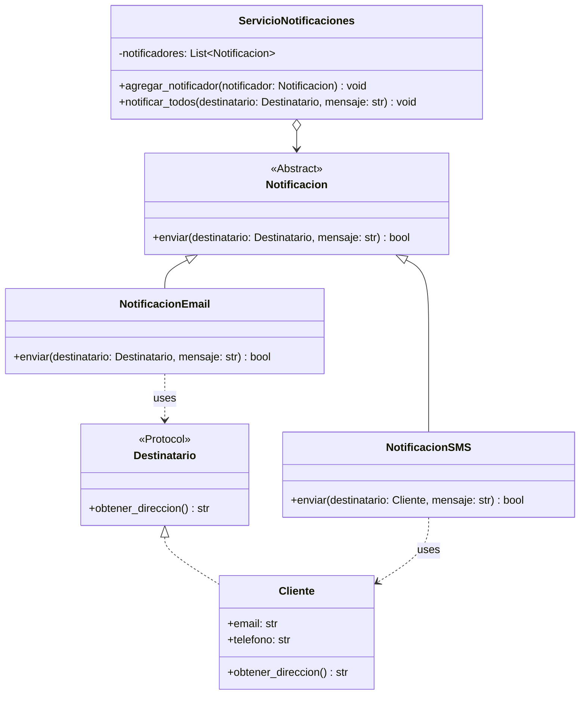
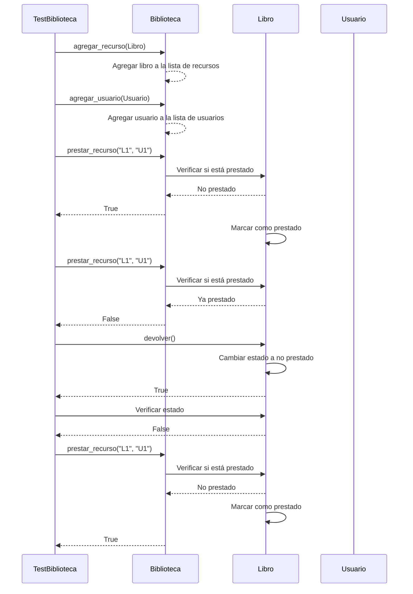

# Jerarquía en Python: Herencia y Composición

## 1. Sistema de Gestión de Biblioteca

### 1.1 Implementación con Herencia

```python
from abc import ABC, abstractmethod
from datetime import datetime, timedelta
from typing import List, Optional, Dict
from dataclasses import dataclass

class RecursoBiblioteca(ABC):
    def __init__(self, codigo: str, titulo: str, ubicacion: str):
        self.codigo = codigo
        self.titulo = titulo
        self.ubicacion = ubicacion
        self.prestado = False
        self.fecha_devolucion: Optional[datetime] = None

    @abstractmethod
    def tiempo_prestamo(self) -> timedelta:
        """Retorna el tiempo máximo de préstamo para este recurso."""
        pass

    def prestar(self) -> bool:
        """Intenta prestar el recurso."""
        if not self.prestado:
            self.prestado = True
            self.fecha_devolucion = datetime.now() + self.tiempo_prestamo()
            return True
        return False

    def devolver(self) -> bool:
        """Registra la devolución del recurso."""
        if self.prestado:
            self.prestado = False
            self.fecha_devolucion = None
            return True
        return False

class Libro(RecursoBiblioteca):
    def __init__(self, codigo: str, titulo: str, autor: str, ubicacion: str):
        super().__init__(codigo, titulo, ubicacion)
        self.autor = autor

    def tiempo_prestamo(self) -> timedelta:
        return timedelta(days=14)

class Revista(RecursoBiblioteca):
    def __init__(self, codigo: str, titulo: str, numero: int, ubicacion: str):
        super().__init__(codigo, titulo, ubicacion)
        self.numero = numero

    def tiempo_prestamo(self) -> timedelta:
        return timedelta(days=7)

class RecursoDigital(RecursoBiblioteca):
    def __init__(self, codigo: str, titulo: str, formato: str, url: str):
        super().__init__(codigo, titulo, "digital")
        self.formato = formato
        self.url = url

    def tiempo_prestamo(self) -> timedelta:
        return timedelta(days=3)
```
## Jerarquia Ej. vehiculos

```python
from abc import ABC, abstractmethod

# Clase base abstracta Vehiculo
class Vehiculo(ABC):
    def __init__(self, marca: str, modelo: str, año: int):
        self.marca = marca
        self.modelo = modelo
        self.año = año

    @abstractmethod
    def mover(self):
        """Método abstracto que debe ser implementado por las subclases."""
        pass

    def __str__(self):
        """Representación en cadena del vehículo."""
        return f"{self.marca} {self.modelo} ({self.año})"


# Clase Motocicleta (hereda de Vehiculo)
class Motocicleta(Vehiculo):
    def __init__(self, marca: str, modelo: str, año: int, tipo_motor: str):
        super().__init__(marca, modelo, año)
        self.tipo_motor = tipo_motor  # Ejemplo: 2 tiempos, 4 tiempos

    def mover(self):
        """Método específico para motos."""
        print(f"La motocicleta {self.marca} {self.modelo} ({self.año}) está acelerando rápidamente.")

    def __str__(self):
        return f"Motocicleta {self.marca} {self.modelo} ({self.año}), Motor: {self.tipo_motor}"


# Clase Automovil (hereda de Vehiculo)
class Automovil(Vehiculo):
    def __init__(self, marca: str, modelo: str, año: int, tipo_combustible: str):
        super().__init__(marca, modelo, año)
        self.tipo_combustible = tipo_combustible  # Ejemplo: gasolina, electrico

    def mover(self):
        """Método específico para automóviles."""
        print(f"El automóvil {self.marca} {self.modelo} ({self.año}) está circulando por la carretera.")

    def __str__(self):
        return f"Automóvil {self.marca} {self.modelo} ({self.año}), Combustible: {self.tipo_combustible}"


# Clase Sedan (hereda de Automovil)
class Sedan(Automovil):
    def __init__(self, marca: str, modelo: str, año: int, tipo_combustible: str, num_puertas: int):
        super().__init__(marca, modelo, año, tipo_combustible)
        self.num_puertas = num_puertas  # Ejemplo: 4 puertas

    def mover(self):
        """Método específico para un sedán."""
        print(f"El sedán {self.marca} {self.modelo} ({self.año}) está viajando cómodamente.")

    def __str__(self):
        return f"Sedán {self.marca} {self.modelo} ({self.año}), Combustible: {self.tipo_combustible}, Puertas: {self.num_puertas}"


# Clase SUV (hereda de Automovil)
class SUV(Automovil):
    def __init__(self, marca: str, modelo: str, año: int, tipo_combustible: str, traccion: str):
        super().__init__(marca, modelo, año, tipo_combustible)
        self.traccion = traccion  # Ejemplo: tracción en las 4 ruedas (AWD), tracción delantera (FWD)

    def mover(self):
        """Método específico para SUV."""
        print(f"El SUV {self.marca} {self.modelo} ({self.año}) está atravesando terrenos difíciles.")

    def __str__(self):
        return f"SUV {self.marca} {self.modelo} ({self.año}), Combustible: {self.tipo_combustible}, Tracción: {self.traccion}"


# Clase Camion (hereda de Vehiculo)
class Camion(Vehiculo):
    def __init__(self, marca: str, modelo: str, año: int, capacidad_carga: int):
        super().__init__(marca, modelo, año)
        self.capacidad_carga = capacidad_carga  # Ejemplo: capacidad de carga en toneladas

    def mover(self):
        """Método específico para camiones."""
        print(f"El camión {self.marca} {self.modelo} ({self.año}) está transportando carga.")

    def __str__(self):
        return f"Camión {self.marca} {self.modelo} ({self.año}), Capacidad de carga: {self.capacidad_carga} toneladas"


```
### 1.2 Implementación con Composición

```python
@dataclass
class Usuario:
    id: str
    nombre: str
    email: str
    tipo: str  # estudiante, profesor, etc.

class HistorialPrestamo:
    def __init__(self):
        self.prestamos: List[Dict] = []

    def registrar_prestamo(
        self, 
        usuario: Usuario, 
        recurso: RecursoBiblioteca
    ) -> None:
        self.prestamos.append({
            'fecha': datetime.now(),
            'usuario': usuario,
            'recurso': recurso,
            'fecha_devolucion': recurso.fecha_devolucion
        })

class Biblioteca:
    def __init__(self):
        self.recursos: List[RecursoBiblioteca] = []
        self.usuarios: List[Usuario] = []
        self.historial = HistorialPrestamo()

    def agregar_recurso(self, recurso: RecursoBiblioteca) -> None:
        self.recursos.append(recurso)

    def agregar_usuario(self, usuario: Usuario) -> None:
        self.usuarios.append(usuario)

    def prestar_recurso(
        self, 
        codigo_recurso: str, 
        id_usuario: str
    ) -> bool:
        recurso = next(
            (r for r in self.recursos if r.codigo == codigo_recurso), 
            None
        )
        usuario = next(
            (u for u in self.usuarios if u.id == id_usuario), 
            None
        )

        if recurso and usuario and recurso.prestar():
            self.historial.registrar_prestamo(usuario, recurso)
            return True
        return False
```

## 2. Ejemplo: Sistema de Notificaciones

```python
from abc import ABC, abstractmethod
from typing import List, Protocol
from dataclasses import dataclass

class Destinatario(Protocol):
    def obtener_direccion(self) -> str:
        ...

@dataclass
class Cliente:
    email: str
    telefono: str
    
    def obtener_direccion(self) -> str:
        return self.email

class Notificacion(ABC):
    @abstractmethod
    def enviar(self, destinatario: Destinatario, mensaje: str) -> bool:
        pass

class NotificacionEmail(Notificacion):
    def enviar(self, destinatario: Destinatario, mensaje: str) -> bool:
        print(f"Enviando email a {destinatario.obtener_direccion()}: {mensaje}")
        return True

class NotificacionSMS(Notificacion):
    def enviar(self, destinatario: Cliente, mensaje: str) -> bool:
        print(f"Enviando SMS a {destinatario.telefono}: {mensaje}")
        return True

class ServicioNotificaciones:
    def __init__(self):
        self.notificadores: List[Notificacion] = []

    def agregar_notificador(self, notificador: Notificacion) -> None:
        self.notificadores.append(notificador)

    def notificar_todos(
        self, 
        destinatario: Destinatario, 
        mensaje: str
    ) -> None:
        for notificador in self.notificadores:
            notificador.enviar(destinatario, mensaje)
```
### Diagrama

## 3. Pruebas Unitarias

```python
import unittest
from datetime import datetime, timedelta

class TestBiblioteca(unittest.TestCase):
    def setUp(self):
        self.biblioteca = Biblioteca()
        self.libro = Libro("L1", "Python Basics", "John Doe", "A1")
        self.usuario = Usuario("U1", "Ana Smith", "ana@email.com", "estudiante")
        
        self.biblioteca.agregar_recurso(self.libro)
        self.biblioteca.agregar_usuario(self.usuario)

    def test_prestamo_libro(self):
        # Prueba préstamo exitoso
        self.assertTrue(
            self.biblioteca.prestar_recurso("L1", "U1")
        )
        self.assertTrue(self.libro.prestado)

        # Prueba préstamo de libro ya prestado
        self.assertFalse(
            self.biblioteca.prestar_recurso("L1", "U1")
        )

    def test_devolucion_libro(self):
        self.biblioteca.prestar_recurso("L1", "U1")
        self.assertTrue(self.libro.devolver())
        self.assertFalse(self.libro.prestado)

class TestNotificaciones(unittest.TestCase):
    def setUp(self):
        self.servicio = ServicioNotificaciones()
        self.cliente = Cliente("user@email.com", "123456789")

    def test_notificacion_multiple(self):
        self.servicio.agregar_notificador(NotificacionEmail())
        self.servicio.agregar_notificador(NotificacionSMS())
        
        # Debería enviar tanto email como SMS
        self.servicio.notificar_todos(
            self.cliente, 
            "Prueba de notificación"
        )
```
### Diagrama de secuencia

## 4. Mejores Prácticas

1. **Herencia**:
   - Usar cuando existe una relación "es-un"
   - Mantener jerarquías poco profundas
   - Favorecer composición sobre herencia

2. **Composición**:
   - Usar cuando existe una relación "tiene-un"
   - Permite mayor flexibilidad
   - Facilita cambios en tiempo de ejecución

3. **Diseño**:
   - Seguir el principio SOLID
   - Documentar relaciones entre clases
   - Usar type hints para claridad

## 5. Ejercicio Propuesto

Implementar un sistema de gestión de empleados con:
1. Jerarquía de empleados (gerentes, desarrolladores, etc.)
2. Sistema de permisos basado en roles
3. Registro de actividades y reportes
4. Notificaciones personalizadas por rol

## Conclusión

La jerarquía en Python puede implementarse eficientemente usando tanto herencia como composición. La clave está en elegir el enfoque adecuado según las necesidades del sistema.
